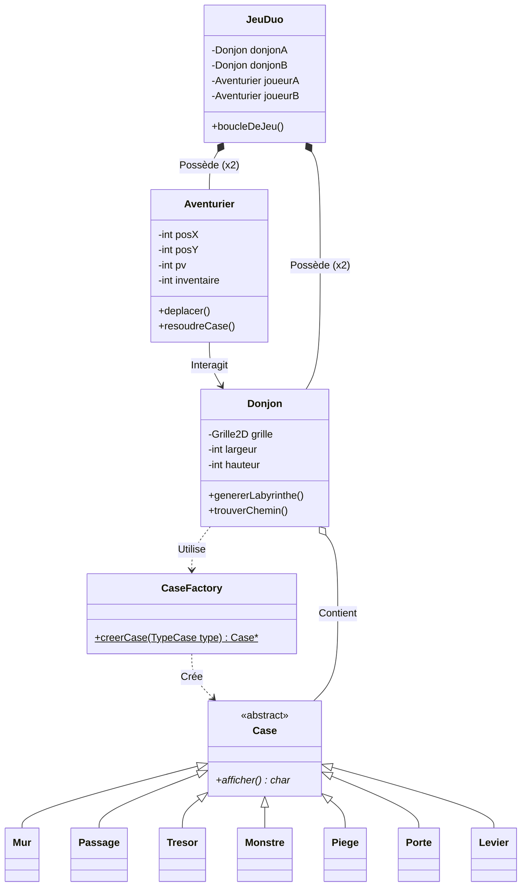
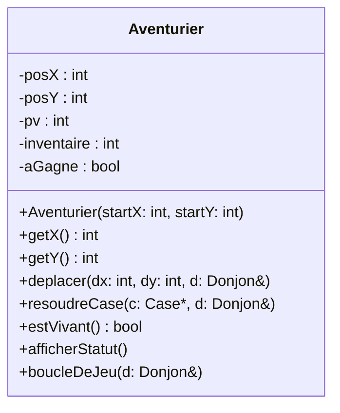

```mermaid
classDiagram
    class Case {
        <<abstract>>
        +afficher()* char
    }
    
    class CaseFactory {
        +creerCase(TypeCase type)$ Case*
    }
    
    class Donjon {
        -Grille2D grille
        -int largeur
        -int hauteur
        +genererLabyrinthe()
        +trouverChemin()
    }
    
    class Aventurier {
        -int posX
        -int posY
        -int pv
        -int inventaire
        +deplacer()
        +resoudreCase()
    }

    class JeuDuo {
        -Donjon donjonA
        -Donjon donjonB
        -Aventurier joueurA
        -Aventurier joueurB
        +boucleDeJeu()
    }

    Case <|-- Mur
    Case <|-- Passage
    Case <|-- Tresor
    Case <|-- Monstre
    Case <|-- Piege
    Case <|-- Porte
    Case <|-- Levier

    CaseFactory ..> Case : Crée
    Donjon o-- Case : Contient
    Donjon ..> CaseFactory : Utilise
    Aventurier --> Donjon : Interagit
    JeuDuo *-- Donjon : Possède (x2)
    JeuDuo *-- Aventurier : Possède (x2)
```

``` mermaid
classDiagram
    class Aventurier {
        %% Attributs réels de votre code
        -posX : int
        -posY : int
        -pv : int
        -inventaire : int
        -aGagne : bool

        %% Méthodes réelles de votre code
        +Aventurier(startX: int, startY: int)
        +getX() int
        +getY() int
        +deplacer(dx: int, dy: int, d: Donjon&)
        +resoudreCase(c: Case*, d: Donjon&)
        +estVivant() bool
        +afficherStatut()
        +boucleDeJeu(d: Donjon&)
    }
```
