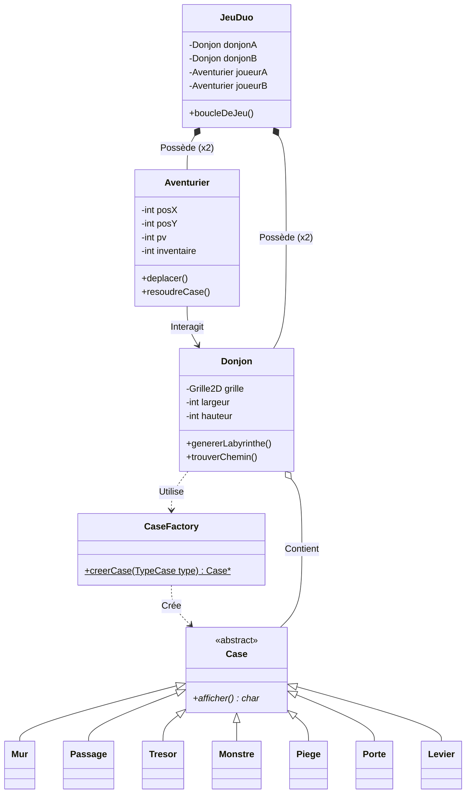
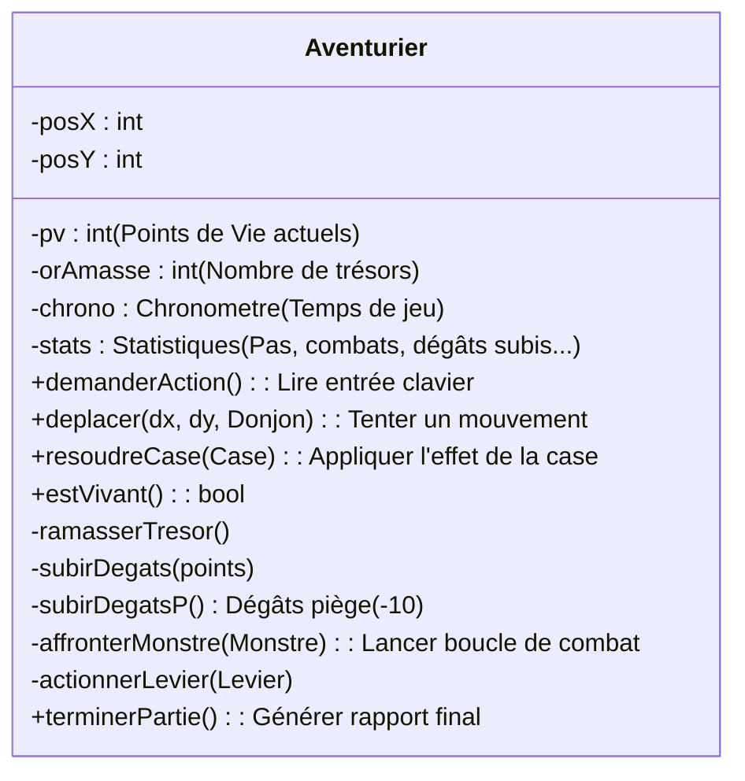

```mermaid
classDiagram
    class Case {
        <<abstract>>
        +afficher()* char
    }
    
    class CaseFactory {
        +creerCase(TypeCase type)$ Case*
    }
    
    class Donjon {
        -Grille2D grille
        -int largeur
        -int hauteur
        +genererLabyrinthe()
        +trouverChemin()
    }
    
    class Aventurier {
        -int posX
        -int posY
        -int pv
        -int inventaire
        +deplacer()
        +resoudreCase()
    }

    class JeuDuo {
        -Donjon donjonA
        -Donjon donjonB
        -Aventurier joueurA
        -Aventurier joueurB
        +boucleDeJeu()
    }

    Case <|-- Mur
    Case <|-- Passage
    Case <|-- Tresor
    Case <|-- Monstre
    Case <|-- Piege
    Case <|-- Porte
    Case <|-- Levier

    CaseFactory ..> Case : Crée
    Donjon o-- Case : Contient
    Donjon ..> CaseFactory : Utilise
    Aventurier --> Donjon : Interagit
    JeuDuo *-- Donjon : Possède (x2)
    JeuDuo *-- Aventurier : Possède (x2)
```

``` mermaid
classDiagram
    class Aventurier {
        %% Données / État (Ce qu'il possède)
        -pv : int (Points de Vie actuels)
        -posX : int
        -posY : int
        -orAmasse : int (Nombre de trésors)
        -chrono : Chronometre (Temps de jeu)
        -stats : Statistiques (Pas, combats, dégâts subis...)

        %% Actions Principales (Ce qu'il fait)
        +demanderAction() : Lire entrée clavier
        +deplacer(dx, dy, Donjon) : Tenter un mouvement
        +resoudreCase(Case) : Appliquer l'effet de la case
        +estVivant() : bool

        %% Interactions Spécifiques
        -ramasserTresor()
        -subirDegats(points)
        -subirDegatsP() : Dégâts piège (-10)
        -affronterMonstre(Monstre) : Lancer boucle de combat
        -actionnerLevier(Levier)

        %% Fin de partie
        +terminerPartie() : Générer rapport final
    }
```
